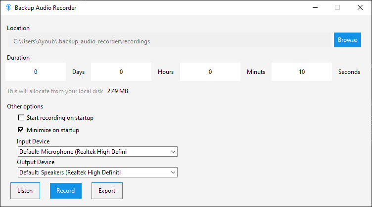

# Backup Audio Recorder

This script record your audio passively and later then you can listen or export the last n seconds

# Getting Started
You can choose to use either the GUI or CLI interface

## GUI

Please download the latest [release](https://github.com/redbayoub/backup_audio_recorder/releases)

## CLI

### Perquisites

1. Install Python 3.9 on your machine
2. Clone the repository to your local disk
3. Run the following command to install dependencies `pip requirements.txt`

### Usage
`python cli.py [-h] -a {record,listen,export} [-d DURATION] -o OUTPUT_DIR [-ef EXPORT_FILE_PATH]`

Arguments:

-h, --help
  
show this help message and exit
  
-a {record,listen,export}, --action {record,listen,export}

the action to be performed

-d DURATION, --duration DURATION

the duration to be kept recorded in seconds

-o OUTPUT_DIR, --output-dir OUTPUT_DIR

the path to the directory where recording are kept

-ef EXPORT_FILE_PATH, --export-file-path EXPORT_FILE_PATH

the path to the file where the recording will be exported

## Building GUI for windows

### Perquisites

1. Install Python 3.9 on your machine
2. Clone the repository to your local disk
3. Run the following command to install dependencies `pip requirements.txt`

*Build Command generated using auto-py-to-exe package*

    pyinstaller --noconfirm --onefile --windowed --icon "D:/Scripts/backup_audio_recorder/icon.ico" --name "Backup Audio Recorder" --add-data "D:/Scripts/backup_audio_recorder/constants.py;." --add-data "D:/Scripts/backup_audio_recorder/dialogs.py;." --add-data "D:/Scripts/backup_audio_recorder/gui.ui;." --add-data "D:/Scripts/backup_audio_recorder/backup_audio_recorder.py;." --add-data "D:/Scripts/backup_audio_recorder/validators.py;." --add-data "D:/Scripts/backup_audio_recorder/threads;threads/" --add-data "D:/Scripts/backup_audio_recorder/icon.ico;." --add-data "D:/Scripts/backup_audio_recorder/utils.py;."  "D:/Scripts/backup_audio_recorder/gui.py"

## Acknowledgments

- [sounddevice](https://github.com/spatialaudio/python-sounddevice) 
- [soundfile](https://github.com/bastibe/python-soundfile) 
- [pygubu](https://github.com/alejandroautalan/pygubu) 
- [pygubu designer](https://github.com/alejandroautalan/pygubu-designer) 
- [pyinstaller](https://github.com/pyinstaller/pyinstaller) 
- [Auto PY to EXE](https://github.com/brentvollebregt/auto-py-to-exe) 

## 📝 License

This project is [LGPL-2.1](./LICENSE) licensed.